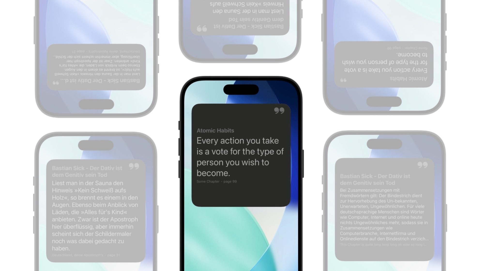
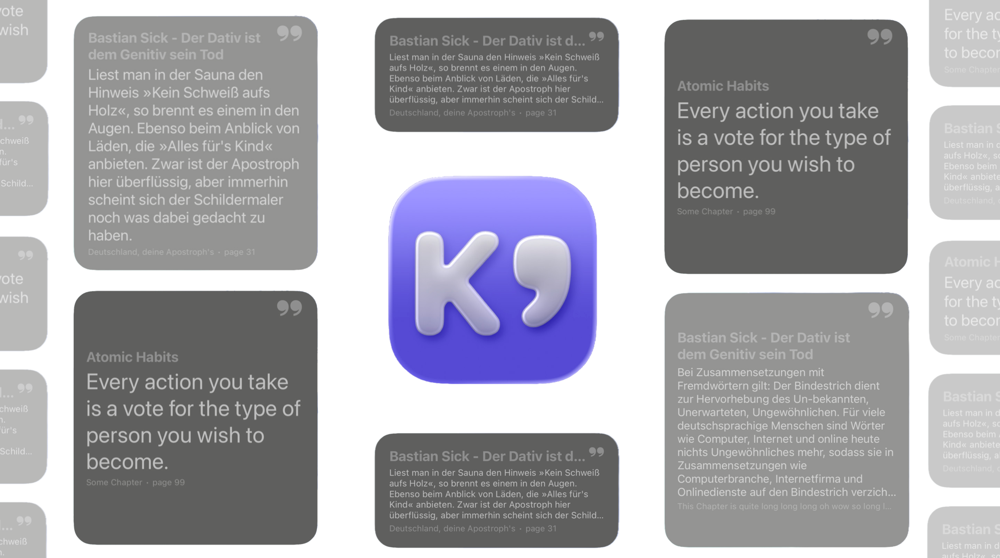
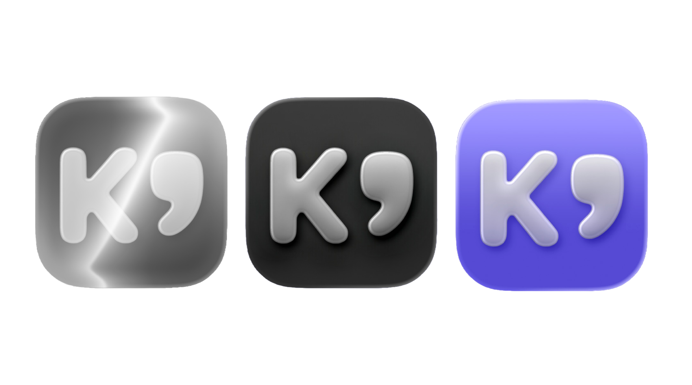

# Kuotes - KOReader Highlights on iOS

Save your KOReader highlights via plugin [koreader-highlight-sync](https://github.com/gitalexcampos/koreader-Highlight-Sync) on a WebDAV server and access them on iOS through Kuotes.

